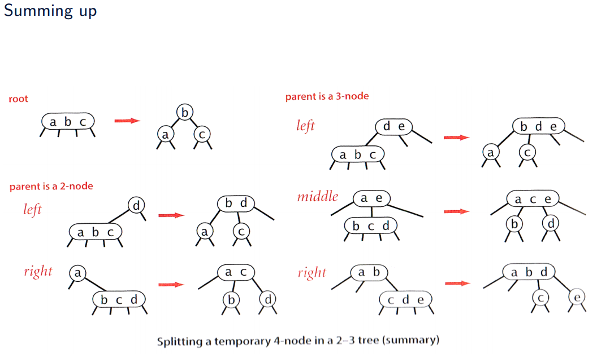

# [Balanced Search Trees and Hash tables](https://datsoftlyngby.github.io/soft2020spring/ALG/week-11/#6-balanced-search-trees-and-hash-tables)

11-03-2020

## Hashed Symbol Tables

**Problem**: We want to access a symbol table with `n` keys, using key  as was it an index to an array with `n` elements.  
**Perfect Solution**: By _magic_ we find a mapping from the keys `K` to . We call it the hash function .  
**Realistic Solution** Find a hash function that maps the keys `K` uniformly over , where .

## Java Lambdas

```java
@FunctionalInterface
public interface HashFunction{
    int function(String key);
}

public static test(String[] keys, HashFunction hash){
    for(String key : keys){
        System.out.println(hash.function(key));
    }
}
public static void main(String... args){
    String[] words = FileUtility.toStringArray("sp.txt", "[^A-Za-z]");
    test(words, k -> k.length());
}
```

## Cuckoo Hashing

-   Insert `O(1)` expected
-   Delete, Query(`O(1)`) Guaranteed
-   Two hash functions  and 

The name derives from the behavior of some species of cuckoo, where the cuckoo chick pushes the other eggs or young out of the nest when it hatches; analogously, inserting a new key into a cuckoo hashing table may push an older key to a different location in the table.

1.  Compute 
2.  If  is empty: done, otherwise if `y` occupies the spot, evict `y` and put `x` in , Try to place `y` using 
3.  If  is empty: done, otherwise evict , put `y` here and repeat this step with evicted value
4.  If more than `log(n)` attemps - rehas

## 2-3 Search Tree


